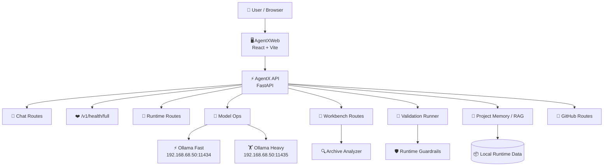
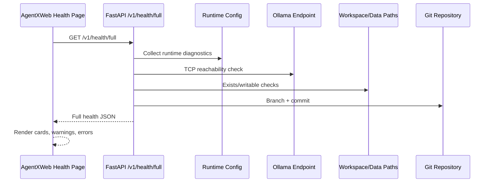
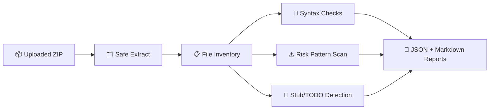
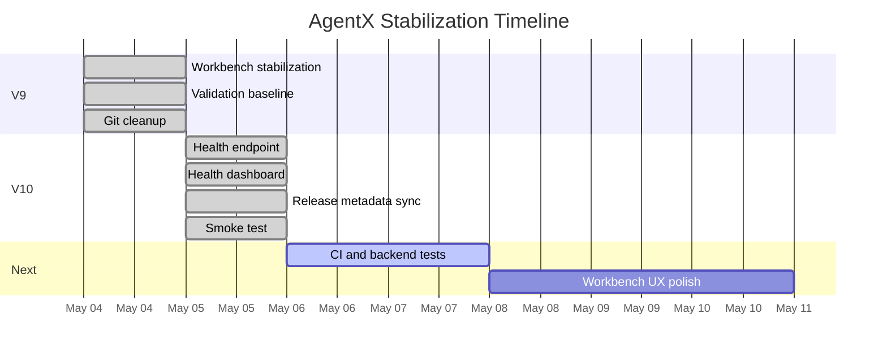

# 🚀 AgentX

<p align="center">
  <strong>Local-first AI assistant • Coding workbench • Validation engine • Homelab automation platform</strong>
</p>

<p align="center">
  
  
  
  
  
</p>

---

## 🌟 What Is AgentX?

**AgentX** is a private, local-first AI control center built for a serious homelab workflow.

It combines a **FastAPI backend**, **React/Vite web UI**, **Ollama model routing**, **workspace/archive analysis**, **validation tooling**, **project memory**, **GitHub-tracked patch workflows**, and a growing browser-based coding workbench.

AgentX is designed around one practical goal:

> Give a local AI assistant real project awareness, workspace tools, validation checks, model routing, and safe patch workflows — without depending on cloud infrastructure.

---

## 🧭 Current Release

| Item | Value |
|---|---|
| 🚩 Latest release | `v0.2.8-v10` |
| 🏷️ Release name | **AgentX V10 — Health Dashboard and Smoke-Test Release** |
| 🧱 Previous baseline | `v0.2.7-v9` |
| 🌐 Web UI | `http://192.168.68.210:5173` |
| 📘 API docs | `http://192.168.68.210:8000/docs` |
| ❤️ Health endpoint | `http://192.168.68.210:8000/v1/health/full` |
| 🧪 Smoke test | `./scripts/smoke-test-v10.sh` |

---

## ✨ V10 Highlights

AgentX V10 adds the first real operational visibility layer.

### ✅ Added

- ❤️ Full backend health endpoint: `/v1/health/full`
- 🖥️ Frontend **Health** dashboard
- 🧠 Runtime memory ignore rules
- 🏷️ Synced V10 frontend release metadata
- 🧪 End-to-end smoke-test script
- 📊 Live checks for API, Ollama, workspaces, validation, warnings, and errors

### ✅ Validated

- API root
- `/v1/status`
- `/v1/health/full`
- Web UI response
- Python `compileall`
- Frontend TypeScript typecheck
- Frontend Vitest tests
- Frontend production build

---

## 🧩 What AgentX Does

| Area | Description |
|---|---|
| 💬 Chat | Chat with local/configured AI models |
| 🧠 Memory | Store and use project-local memory/context |
| 🧰 Workbench | Import, inspect, and analyze workspaces/archives |
| 🧪 Validation | Run presets and validate patch candidates |
| 🖥️ Code UI | Use scripts, code canvas, and frontend workspaces |
| 🤖 Model routing | Use Ollama endpoints for fast/heavy local model paths |
| ❤️ Health | See live API/runtime/Ollama/workspace status |
| 🛡️ Guardrails | Runtime safety checks and validation-first workflows |
| 🧾 Git tracking | Commit/push patch work into GitHub cleanly |
| 🏠 Homelab ops | Built around a private VM/LAN deployment model |

---

## 🏗️ Architecture Overview



---

## 🗂️ Project Structure

```text
AgentX/
├── AgentX/                         # Core Python project package area
│   └── agentx/                     # Canonical lowercase Python package
│       ├── cli/                    # CLI entrypoints
│       ├── core/                   # Core assistant/runtime logic
│       ├── install/                # Install/bootstrap helpers
│       ├── jobs/                   # Job planning/running helpers
│       ├── learning/               # Learning/hint helpers
│       ├── plugins/                # Plugin system
│       ├── runtime/                # Runtime bootstrap/services
│       ├── skills/                 # Skill support
│       ├── tools/                  # Tool support
│       └── workbench/              # Archive/workspace analysis tools
│
├── AgentXWeb/                      # React/Vite frontend
│   ├── public/                     # Static runtime config and workspace page
│   └── src/
│       ├── api/                    # API client
│       ├── config.ts               # Frontend config/runtime metadata
│       └── ui/                     # Main UI
│
├── apps/
│   └── api/
│       ├── agentx_api/             # FastAPI backend
│       │   ├── routes/             # API routes
│       │   ├── data/               # Runtime API data
│       │   ├── runtime_guard.py    # Runtime guardrails
│       │   └── validation_runner.py
│       └── tests/                  # Backend tests
│
├── scripts/                        # Install, repair, smoke-test scripts
├── readme/                         # Supplemental/patch-specific README archive
├── CHANGELOG.md                    # Release notes
└── README.md                       # Main project overview
```

> ⚠️ The canonical Python package is lowercase: `AgentX/agentx/`. Do not recreate the old stale uppercase duplicate `AgentX/AgentX/`.

---

## 🖥️ AgentXWeb UI

AgentXWeb is the main browser interface.

| Mode | Purpose |
|---|---|
| ⌁ Command | Chat and command surface |
| ✎ Drafts | Draft/code workspace actions |
| ◈ Memory | Project memory and knowledge |
| ◇ Scripts | Saved/generated code artifacts |
| ◎ Models | Ollama/model status and selection |
| ✦ Health | V10 runtime health dashboard |
| ✓ Validate | Workspace validation and patch candidate checks |
| ▣ Workspaces | Uploaded archives and sandbox workspaces |
| ⎇ GitHub | Repository/update controls |
| ⋯ Settings | Assistant and UI configuration |

---

## ⚡ Backend API

The backend is a FastAPI service located at:

```text
apps/api/agentx_api/
```

Important routes:

| Route | Purpose |
|---|---|
| `/v1/status` | Basic API/model status |
| `/v1/health/full` | Full V10 health report |
| `/v1/chat` | Chat endpoint |
| `/v1/runtime` | Runtime diagnostics/actions |
| `/v1/model-ops` | Model/Ollama operations |
| `/v1/workbench` | Archive/workspace workbench routes |
| `/v1/validation` | Validation presets/runs/patch candidates |
| `/v1/qol` | Quality-of-life helper routes |
| `/v1/settings` | AgentX settings |
| `/v1/threads` | Thread storage |
| `/v1/projects` | Project records |
| `/v1/scripts` | Saved scripts/artifacts |
| `/v1/rag` | RAG/project knowledge routes |
| `/v1/github` | GitHub status/update routes |

---

## ❤️ V10 Health System

V10 adds:

```text
GET /v1/health/full
```

Example:

```bash
curl -s http://127.0.0.1:8000/v1/health/full | python3 -m json.tool
```

The Health dashboard reports:

- AgentX version
- API service status
- API host/port
- Auth status
- Rate-limit status
- Git branch
- Git commit
- Python version
- Ollama endpoint status
- Workspace path status
- Thread/project/script directory status
- Validation availability
- Warnings
- Errors

### Health Data Flow



---

## 🤖 Ollama Model Routing

AgentX is designed to use local Ollama endpoints.

Current homelab convention:

| Slot | Endpoint | Purpose |
|---|---|---|
| ⚡ Default/Fast | `http://192.168.68.50:11434` | Fast local model path |
| 🏋️ Heavy | `http://192.168.68.50:11435` | Larger/heavier model path |

The Health dashboard reports endpoint reachability, host, port, latency, and errors.

---

## 🧰 Workbench and Archive Analysis

Workbench files live under:

```text
AgentX/agentx/workbench/
```

Key files:

```text
analyzer.py
archive_workspace.py
playground.py
```

The workbench analyzer can:

- Import ZIP/archive projects
- Safely extract files
- Build project inventories
- Detect file types
- Skip noisy folders like `.git`, `node_modules`, `venv`, `dist`, and `build`
- Scan Python/JSON/XML syntax
- Detect possible risky code patterns
- Detect stubs, TODOs, and converted-code markers
- Generate JSON analysis reports
- Generate Markdown final reports

### Analyzer Pipeline



---

## 🧪 Validation System

AgentX includes validation tooling for workspaces and patch candidates.

Backend files:

```text
apps/api/agentx_api/routes/validation.py
apps/api/agentx_api/validation_runner.py
apps/api/agentx_api/runtime_guard.py
```

Frontend page:

```text
AgentXWeb/src/ui/pages/ValidationPage.tsx
```

The validation system supports:

- Workspace selection
- Validation presets
- Validation run history
- Patch candidate validation
- Repair packet generation
- Result summaries
- Copyable validation output

---

## 🛡️ Runtime Guardrails

AgentX is built around validation-first workflows.

Runtime guardrail direction:

- Keep powerful operations explicit
- Track request context
- Add rate-limiting support
- Avoid silent destructive actions
- Make patch/validation workflows auditable
- Prefer preview + validation before applying changes

Guardrail-related files:

```text
apps/api/agentx_api/runtime_guard.py
apps/api/tests/test_runtime_guardrails.py
```

---

## 🏠 Local VM Deployment

Current homelab deployment:

| Item | Value |
|---|---|
| VM IP | `192.168.68.210` |
| Web UI | `http://192.168.68.210:5173` |
| API docs | `http://192.168.68.210:8000/docs` |
| Health | `http://192.168.68.210:8000/v1/health/full` |

Systemd services:

```text
agentx-api.service
agentx-web.service
```

Check status:

```bash
sudo systemctl status agentx-api.service --no-pager
sudo systemctl status agentx-web.service --no-pager
```

Restart:

```bash
sudo systemctl restart agentx-api.service agentx-web.service
```

Logs:

```bash
journalctl -u agentx-api.service -n 100 --no-pager
journalctl -u agentx-web.service -n 100 --no-pager
```

---

## 🧪 Smoke Testing

Run the V10 smoke test:

```bash
./scripts/smoke-test-v10.sh
```

The smoke test checks:

| Step | Check |
|---:|---|
| 1 | API root |
| 2 | `/v1/status` |
| 3 | `/v1/health/full` |
| 4 | Web UI response |
| 5 | Python compileall |
| 6 | Frontend typecheck + tests |
| 7 | Frontend production build |

Expected ending:

```text
AgentX V10 smoke test passed.
```

---

## 🧑‍💻 Frontend Development

Install dependencies:

```bash
cd AgentXWeb
npm install
```

Typecheck:

```bash
npm run typecheck
```

Run tests:

```bash
npm test
```

Build production bundle:

```bash
npm run build
```

Run dev server:

```bash
npm run dev -- --host 0.0.0.0 --port 5173
```

Current frontend package:

```text
agentx-web@0.2.8-v10
```

---

## 🐍 Backend Development

Syntax validation:

```bash
python3 -m compileall AgentX/agentx apps/api/agentx_api apps/api/tests
```

Manual API run:

```bash
cd ~/projects/AgentX
source .venv/bin/activate
uvicorn agentx_api.app:create_app --factory --host 0.0.0.0 --port 8000
```

Backend tests require `pytest`:

```bash
python3 -m pip install pytest
python3 -m pytest apps/api/tests -q
```

Future work should add a proper backend dev dependency file.

---

## 📚 Documentation Layout

The root `README.md` is reserved for the main AgentX project overview.

Patch-specific and feature-specific README files belong in:

```text
readme/
```

Examples:

```text
readme/README-V9.md
readme/README_AGENTX_QOL_WORKSPACES.md
readme/README_AUTO_PATCH_PREVIEW_BRIDGE.md
readme/README_FRONTEND_ARCHIVE_WORKBENCH.md
readme/README_WORKSPACE_VALIDATION.md
readme/README_OLLAMA_FIX.md
```

---

## 🔀 Git Workflow

Repository:

```text
https://github.com/unbridledpc/AgentX
```

Recommended workflow:

```bash
git checkout main
git pull origin main
git checkout -b feature/my-feature
```

After changes:

```bash
git status --short
./scripts/smoke-test-v10.sh
git add <files>
git commit -m "Describe the change"
git push -u origin feature/my-feature
```

Merge when validated:

```bash
git checkout main
git pull origin main
git merge --no-ff feature/my-feature -m "Merge my feature"
git push origin main
```

---

## 🏷️ Release Tags

| Tag | Description |
|---|---|
| `v0.2.7-v9` | Workbench stabilization and validation baseline |
| `v0.2.8-v10` | Health dashboard and smoke-test release |

Create a tag:

```bash
git tag -a v0.2.8-v10 -m "AgentX V10 health dashboard and smoke-test release"
git push origin v0.2.8-v10
```

---

## 📈 Release Timeline



---

## 📜 Release History

### `v0.2.8-v10` — Health Dashboard and Smoke-Test Release

Added:

- `/v1/health/full`
- Frontend Health dashboard
- Runtime health display
- Ollama endpoint checks
- Workspace writability checks
- Validation availability display
- V10 release metadata sync
- `.env.example`
- Runtime memory ignore rules
- `scripts/smoke-test-v10.sh`

Validated:

- API root
- API status
- Full health endpoint
- Web UI
- Python compileall
- Frontend typecheck
- Frontend tests
- Frontend production build

---

### `v0.2.7-v9` — Workbench Stabilization and Validation Baseline

Added/stabilized:

- AgentXWeb typecheck/build gate
- Workbench/archive analyzer backend
- Runtime/model/QoL/validation/workbench API routes
- Runtime guardrails
- Validation runner
- Frontend workspace/validation UI
- Docs and installer scripts
- `.gitignore` cleanup
- Clean GitHub-tracked V9 baseline

---

## ⚠️ Known Non-Blocking Warning

Frontend production builds may show:

```text
Some chunks are larger than 500 kB after minification.
```

This is currently non-blocking. A future release should add code-splitting or route-level dynamic imports.

---

## 🔐 Security Notes

AgentX is designed for private/local use.

Current common homelab warnings:

- Authentication may be disabled.
- Web access may be enabled broadly.
- Local filesystem/workspace tools can be powerful.
- AgentX should be kept behind a trusted LAN/firewall unless hardened.

Before exposing outside the LAN:

- Enable authentication
- Restrict CORS
- Restrict web access allowlists
- Restrict filesystem roots
- Enable rate limiting
- Review environment variables and service configs

---

## 🛣️ Roadmap

### V11 — CI and Backend Test Cleanup

- Add GitHub Actions for frontend typecheck/tests/build
- Add backend compile/test job
- Add backend dev dependency file
- Make `pytest` runnable out of the box
- Add health endpoint tests
- Add validation route tests

### V12 — Workbench UX Polish

- Better upload progress
- Better validation result views
- Better patch candidate summaries
- Downloadable reports
- Cleaner workspace file tree
- Safer patch apply UX

### V13 — Model Routing and Runtime Intelligence

- Heavy/fast model route selection UI
- Endpoint profiles
- Model benchmark/status cache
- GPU-aware routing
- Better Ollama model refresh controls

### V14 — Assistant Coding Workbench

- Browser-based coding playground improvements
- Code canvas persistence
- Patch preview improvements
- Repo-aware repair flows
- GitHub PR/branch helpers

---

## ⚡ Quick Commands

Check repo:

```bash
git status --short
git branch --show-current
git log --oneline -5
```

Run full smoke test:

```bash
./scripts/smoke-test-v10.sh
```

Restart services:

```bash
sudo systemctl restart agentx-api.service agentx-web.service
```

Check services:

```bash
sudo systemctl status agentx-api.service agentx-web.service --no-pager
```

Open app:

```text
http://192.168.68.210:5173
```

Open API docs:

```text
http://192.168.68.210:8000/docs
```

Open health endpoint:

```text
http://192.168.68.210:8000/v1/health/full
```

---

## ✅ Project Status

AgentX is actively evolving.

- **V9** turned the project into a clean, tracked baseline.
- **V10** added live system visibility and a full smoke-test gate.
- **V11** should make validation automatic through CI.

AgentX is now in a strong position to evolve from local assistant into a full AI-powered homelab workbench.

---

<p align="center">
  <strong>AgentX — local AI with real tools, real validation, and real project memory.</strong>
</p>
